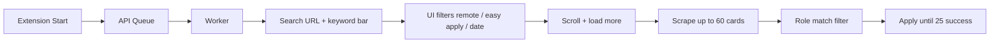

# Naukri morning run — design (Step 7)

## Goal

One click in the morning → apply to **up to 25 relevant jobs** with filters applied correctly (e.g. **Node.js Developer**).

## How it works



## Filter accuracy

| Step | What |
|------|------|
| URL | `k=Node.js Developer`, slug `nodejs-developer-jobs` (dots removed) |
| Search bar | Re-types your **Role** on the page so Naukri matches keyword |
| URL params | `remoteFilter`, `wfhType=2`, `experience`, `jobAge` |
| UI | Remote, Easy Apply, date chips (best-effort) |
| Scrape filter | Drops jobs whose **title** does not match role tokens (`nodejs`, `developer`, …) |

## Apply volume (why you only saw 1 before)

| Old behavior | New behavior |
|--------------|--------------|
| Stop after **5 attempts** (many failed) | Keep trying until **25 successful** applies |
| ~30 jobs scraped | Up to **60** after scroll/load more |
| Strict failed = run failed | Success if **≥3** applies (configurable target 25) |

## Worker `.env`

```env
MAX_APPLICATIONS_PER_RUN=0
NAUKRI_SCRAPE_LIMIT=60
NAUKRI_SCROLL_ROUNDS=5
NAUKRI_FAST_APPLY=true
```

## Panel settings for morning run

- **Role:** exact title you want (e.g. `Node.js Developer`)
- **Experience / Date / Remote / Easy Apply:** as needed
- **Full Auto:** ON

## Realistic expectations

- Not every listing allows Easy Apply — failures are skipped; worker continues.
- 25 applies may take **15–40 minutes** (Naukri UI + delays to avoid blocks).
- First run still needs a valid **session** and **resume path**.
